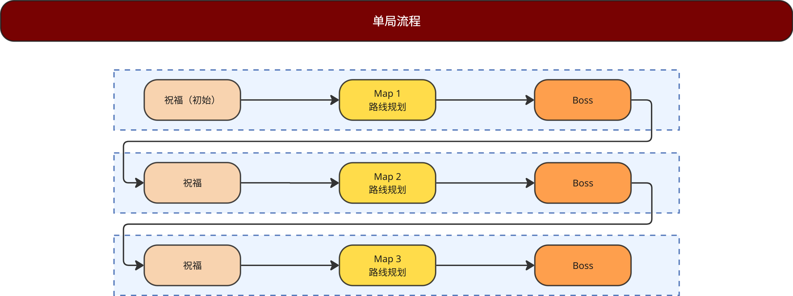
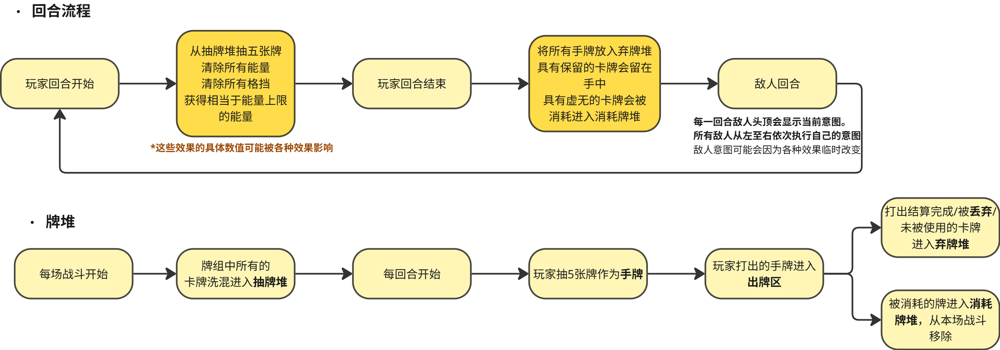

# 《深渊血契》游戏设计文档

## 核心版本 Demo 策划案 v1.0

---

## 一、执行摘要

### 1.1 游戏概述

- **游戏名称：** 深渊血契（Abyssal Pact）
- **核心玩法：** 玩家扮演「血契骑士」（暂时设计了一个角色），通过在战斗中「借贷」生命来获得即时强力效果，在「血债」清算前规划进攻与防御，在死亡前尽可能攀登更高的塔层。
- **核心差异化：** 「血债」机制将传统的「自伤 = 损失」转化为「借贷 = 燃料」，玩家不再是被动承受惩罚，而是主动管理风险资源。
- **目标平台：** PC / 演示 Demo（Unity）

---

## 二、单局流程（完整爬塔流程）

### 2.1 单局结构概览



```
序章 -> 第一章 -> 第二章 -> 终章
教学战 -> 普通战斗x3 -> 精英战 -> 普通战斗x4 -> BOSS战
         |         |         |               |
         v         v         v               v
       篝火/商店   随机事件   篝火/商店        结算
```

### 2.2 节点类型与频率

| 节点类型 | 第一章 | 第二章 | 备注               |
| -------- | ------ | ------ | ------------------ |
| 普通战斗 | 3次    | 4次    | 基础难度递进       |
| 精英战斗 | 1次    | 1次    | 固定在第4层        |
| BOSS战   | 0次    | 1次    | 第二章末           |
| 篝火     | 1-2次  | 1次    | 恢复生命或升级卡牌 |
| 商店     | 1-2次  | 1-2次  | 购买卡牌/遗物/药水 |
| 随机事件 | 1-2次  | 1-2次  | 剧情分支/增益/诅咒 |
| 宝藏     | 0-1次  | 0-1次  | 直接获得遗物       |

- 每章节点数量：5-6个节点/章节
- 总节点数量：10-12个节点/单局

### 2.3 地图结构设计

- 节点之间以线连接，玩家只能沿路线前进
- 每层提供2-3个分支选择
- 精英战和BOSS战在路线末端
- 篝火和商店倾向于放在分岔点后

---

## 三、战斗循环

### 3.1 回合制战斗流程



```
[回合开始]
-> 血债触发伤害 -> 若死亡则结束
-> 玩家回合开始 -> 展示意图
-> 玩家出牌 -> 卡牌效果结算 -> 能量归零 -> 结束出牌
-> 回合结束 -> 敌人回合执行意图 -> 结算
-> 战斗胜利/失败
-> 若未结束：抽牌、能量回满、血债-1层，进入下一回合
```

### 3.2 战斗核心资源

| 资源     | 数值     | 重置时机               | 说明                         |
| -------- | -------- | ---------------------- | ---------------------------- |
| 能量     | 3点/回合 | 每回合开始             | 出牌消耗，可通过能力增加上限 |
| 手牌上限 | 10张     | 每回合开始             | 手牌超过上限时，弃牌至上限   |
| 血债层数 | 0开始    | 战斗内累积，战斗外清除 | 每层每回合结算时造成1点伤害  |
| 格挡     | 0开始    | 每回合开始归零         | 吸收伤害，先于生命值扣减     |
| 临时生命 | 0开始    | 回合结束清除           | 优先于永久生命值扣减         |

### 3.3 能量系统设计

- 初始能量：3点
- 能量获取：每回合自动获得3点
- 能量上限：3点（可通过遗物/能力增加）
- 能量不可跨回合保留
- 能量归零时自动结束出牌阶段

费用曲线参考：

| 费用 | 基础效果估值          | 血契骑士特殊加成 |
| ---- | --------------------- | ---------------- |
| 0费  | 5-6伤害 或 4-5格挡    | +1血债           |
| 1费  | 8-10伤害 或 6-8格挡   | +2血债           |
| 2费  | 12-15伤害 或 10格挡   | +3血债           |
| 3费  | 20-25伤害 或 强力效果 | +5血债           |

### 3.4 战斗胜利/失败条件

| 条件     | 触发                              | 结果                     |
| -------- | --------------------------------- | ------------------------ |
| 胜利     | 敌人生命值 <= 0                   | 进入战斗结算，获得奖励   |
| 失败     | 玩家生命值 <= 0                   | 游戏结束，显示单局统计   |
| 特殊失败 | 血债层数 = 生命值，且触发血债伤害 | 直接判定死亡（血债清算） |

---

## 四、子系统设计

### 4.1 角色系统：血契骑士

#### 4.1.1 角色基础属性

| 属性         | 初始值 | 说明                |
| ------------ | ------ | ------------------- |
| 生命值       | 80     | 可通过遗物/休息增加 |
| 初始能量     | 3      | 可通过遗物增加上限  |
| 初始手牌上限 | 10     | 可通过遗物增加      |
| 初始格挡     | 0      | 每回合归零          |

#### 4.1.2 角色核心机制

**血债（Blood Debt）系统：**

- 获得血债：大多数攻击/技能卡会附带血债；部分能力卡主动获得血债；血债层数可叠加
- 血债结算：每回合开始结算一次；每层血债造成1点伤害；伤害优先由临时生命吸收；临时生命不足则扣除永久生命；血债层数不清除，持续生效
- 消耗血债：部分卡牌效果需要消耗血债；消耗后血债层数减少
- 清除血债：休息事件可清除血债；特定卡牌可清除血债；战斗结束时血债清零

**血债风险评估表：**

| 血债层数 | 每回合伤害 | 3回合总伤害 | 风险等级 |
| -------- | ---------- | ----------- | -------- |
| 1层      | 1          | 3           | 低风险   |
| 2-3层    | 2-3        | 6-9         | 中风险   |
| 4-5层    | 4-5        | 12-15       | 高风险   |
| 6层以上  | 6+         | 18+         | 危险     |

---

### 4.2 卡牌系统

#### 4.2.1 卡牌分类结构

- 按类型分：攻击牌、技能牌、能力牌、诅咒牌
- 按稀有度分：基础牌、普通牌、稀有牌
- 按关键词分：爆发型、控制型、防御型、引擎型

#### 4.2.2 完整卡牌列表

**基础牌（起始牌组）**

| 卡牌名   | 费用 | 效果                             | 稀有度 | 数量 |
| -------- | ---- | -------------------------------- | ------ | ---- |
| 打击     | 0    | 造成5伤害，+1血债                | 基础   | 5    |
| 防御     | 1    | 获得6格挡，+1血债                | 基础   | 5    |
| 血契觉醒 | 1    | 能力：你的下一张牌效果x2，+2血债 | 基础   | 1    |

**普通牌**

| 卡牌名   | 费用 | 效果                                                | 稀有度 |
| -------- | ---- | --------------------------------------------------- | ------ |
| 高利贷   | 1    | 获得10临时生命，+3血债                              | 普通   |
| 债务转移 | 1    | 转移2血债给敌人；敌人下回合行动前受到2伤害，-2血债  | 普通   |
| 吸血之债 | 1    | 造成4伤害，恢复4生命，+1血债                        | 普通   |
| 延迟还债 | 0    | 将1层血债的结算延迟1回合                            | 普通   |
| 血债投资 | 2    | 获得3血债，抽2张牌，+3血债                          | 普通   |
| 强制清算 | 2    | 造成12伤害，消耗所有血债                            | 普通   |
| 债务护盾 | 1    | 获得8格挡，消耗1血债                                | 普通   |
| 血契强化 | 1    | 能力：本回合你获得的血债翻倍，+2血债                | 普通   |
| 债权人   | 2    | 能力：每有1血债，攻击牌多造成1伤害（3回合），+2血债 | 普通   |
| 破产清算 | 0    | 造成20伤害，消耗5血债，本回合不能再获得血债         | 普通   |

**稀有牌**

| 卡牌名       | 费用 | 效果                                                | 稀有度 |
| ------------ | ---- | --------------------------------------------------- | ------ |
| 死亡契约     | 3    | 造成30伤害，+10血债                                 | 稀有   |
| 无限债务循环 | 2    | 能力：每消耗1血债，抽1张牌                          | 稀有   |
| 血债转利     | 2    | 获得15格挡和15力量，-5血债                          | 稀有   |
| 献祭者       | 1    | 消耗3血债，本回合所有牌费用-1                       | 稀有   |
| 债主之怒     | 2    | 造成10伤害，之后每层血债追加3伤害，+3血债           | 稀有   |
| 血契符文     | 2    | 能力：每回合开始获得1血债；每2血债获得1力量，+1血债 | 稀有   |
| 债务赦免     | 1    | 清除所有血债，恢复15生命                            | 稀有   |
| 抵押资产     | 2    | 能力：本场战斗每层血债多造成2伤害，+3血债           | 稀有   |

**能力牌（遗物触发/事件牌）**

| 卡牌名   | 费用 | 效果                                                          | 来源 |
| -------- | ---- | ------------------------------------------------------------- | ---- |
| 破产保护 | 1    | 能力：你不会因血债死亡；当降至1HP时，自动清除所有血债         | 遗物 |
| 血契祭坛 | 0    | 事件牌：选择A：获得5血债并抽3张牌；选择B：消耗5血债获得50金币 | 事件 |

---

### 4.3 敌人系统

#### 4.3.1 敌人分类

- 普通敌人：单一意图，数值较低
- 精英敌人：多意图切换，数值较高，有特殊机制
- BOSS：多阶段，多技能，多机制

#### 4.3.2 完整敌人列表

**普通敌人（5种）**

| 敌人名 | 生命值 | 行动模式                              | 攻击伤害 | 设计意图                     |
| ------ | ------ | ------------------------------------- | -------- | ---------------------------- |
| 哥布林 | 20     | 攻击(8)->攻击(8)->防御(5)             | 8        | 基础节奏，教会玩家格挡概念   |
| 骷髅兵 | 25     | 攻击(10)->攻击(10)->蓄力->重击(20)    | 10/20    | 蓄力机制，迫使玩家提前打断   |
| 蝙蝠群 | 15     | 多段攻击(4x2)->攻击(6)->多段攻击(4x3) | 4-6      | 高频率低伤害，克制防御牌过多 |
| 史莱姆 | 30     | 攻击(5)->分裂->攻击(8)                | 5-8      | 分裂机制，时间压力设计       |
| 丧尸   | 35     | 攻击(12)->防御(8)->攻击(12)->回复(5)  | 12       | 持久战型，需要高爆发         |

**精英敌人（3种）**

| 敌人名     | 生命值 | 意图循环                                     | 特殊机制                | 设计意图                     |
| ---------- | ------ | -------------------------------------------- | ----------------------- | ---------------------------- |
| 哥布林首领 | 60     | 攻击(15)->攻击(15)->召唤哥布林->狂暴(25)     | 每2回合召唤1个5HP哥布林 | 召唤压力，需要优先击杀召唤物 |
| 骷髅法师   | 50     | 攻击(8)->诅咒(获得易伤)->攻击(8)->大爆炸(25) | 每3回合施放全屏攻击     | 诅咒叠加，需要爆发输出       |
| 蝙蝠王     | 55     | 多段(6x3)->闪避->多段(8x4)->攻击(15)         | 第2回合闪避所有攻击     | 闪避机制，克制单一攻击       |

**BOSS：深渊领主（第一章BOSS）**

| 属性   | 数值               |
| ------ | ------------------ |
| 生命值 | 150                |
| 阶段   | 2阶段（100HP切换） |

第一阶段（150-100HP）：

- 血契诅咒：玩家获得3血债
- 暗影打击：造成15伤害
- 血债收割：造成8 + 玩家血债层数伤害
- 蓄力：无伤害，下回合技能强化
- 鲜血盛宴：造成25伤害，回复25生命
- 循环：重复回合1-5

第二阶段（100-0HP）：

- 血债传染：玩家获得5血债
- 暗影打击x2：造成12x2伤害
- 血之锁链：玩家获得3血债；本回合无法获得格挡
- 血债收割EX：造成10 + 玩家血债层数x2伤害
- 鲜血仪式：造成30伤害，回复30生命
- 循环：重复回合1-5

BOSS设计要点：

- 血债传染机制迫使玩家考虑风险
- 第二阶段血债传染翻倍，高血债层数会被反噬
- 穿插治疗回合，考验玩家爆发能力

---

### 4.4 遗物系统

#### 4.4.1 遗物分类

- 初始遗物：每个角色独有，战斗开始必带
- 战斗遗物：战斗内获得，战斗后消失
- 永久遗物：获得后永久携带

#### 4.4.2 完整遗物列表

**初始遗物**

| 遗物名   | 效果                | 设计意图         |
| -------- | ------------------- | ---------------- |
| 血契印记 | 战斗开始时获得2血债 | 加速血债系统上手 |

**战斗遗物（战斗内临时获得）**

| 遗物名   | 效果                       | 稀有度 |
| -------- | -------------------------- | ------ |
| 临时契约 | 本场战斗获得+1能量上限     | 普通   |
| 血之祝福 | 本场战斗你的血债效果+50%   | 普通   |
| 债主垂青 | 本场战斗你的血债不造成伤害 | 稀有   |

**永久遗物**

| 遗物名   | 效果                                 | 稀有度 | 获取方式 |
| -------- | ------------------------------------ | ------ | -------- |
| 血契项链 | 每场战斗开始时，获得1层血债          | 普通   | 商店购买 |
| 恶魔骰子 | 20%几率获得双倍血债（同样双倍风险）  | 普通   | 随机事件 |
| 债务保险 | 血债结算伤害最多为当前生命值的50%    | 稀有   | 精英掉落 |
| 深渊契约 | 战斗中每消耗5血债，恢复1生命         | 稀有   | BOSS掉落 |
| 无限透支 | 能量可为负数，但负数值的血债立即生效 | 史诗   | 宝藏获得 |
| 血契传承 | 离开休息点时额外获得10生命上限       | 稀有   | 商店购买 |

---

### 4.5 药水系统

#### 4.5.1 药水基础规则

- 每场战斗前可携带最多3瓶药水
- 战斗中可随时使用，不消耗回合
- 大多数药水为一次性使用
- 部分稀有药水可持续整场战斗
- 药水在进入新节点前刷新

#### 4.5.2 完整药水列表

| 药水名       | 效果                   | 稀有度 | 价格   |
| ------------ | ---------------------- | ------ | ------ |
| 生命药水     | 恢复15生命             | 普通   | 30金币 |
| 能量药水     | 获得2能量              | 普通   | 35金币 |
| 血债清除剂   | 清除5层血债            | 普通   | 40金币 |
| 力量药水     | 获得3力量（持续3回合） | 普通   | 45金币 |
| 临时生命药水 | 获得20临时生命         | 普通   | 40金币 |
| 格挡药水     | 获得20格挡             | 普通   | 35金币 |
| 黄金药水     | 本次战斗获得双倍金币   | 稀有   | 60金币 |
| 生命上限药水 | 永久增加5生命上限      | 稀有   | 80金币 |
| 血债转移药水 | 将所有血债转移给敌人   | 稀有   | 70金币 |

---

### 4.6 事件系统

#### 4.6.1 事件分类

- 增益事件：提供卡牌/遗物/金币/血量奖励
- 抉择事件：风险/回报型、牺牲/交换型
- 诅咒事件：获得负面效果/诅咒牌
- 特殊事件：剧情推进/角色互动

#### 4.6.2 完整事件列表

| 事件名     | 类型 | 内容描述                                       | 选项A                                 | 选项B                       |
| ---------- | ---- | ---------------------------------------------- | ------------------------------------- | --------------------------- |
| 血契祭坛   | 抉择 | 一座散发着血红光芒的祭坛，似乎蕴含着古老的力量 | 获得5血债并抽3张牌                    | 消耗5血债获得50金币         |
| 恶魔交易   | 抉择 | 一个低语的声音提出交易...                      | 失去20生命上限，获得「深渊之心」遗物  | 获得100金币，失去15当前生命 |
| 受伤的旅人 | 增益 | 一个受伤的旅人递给你一些东西                   | 获得随机遗物（需消耗15生命）          | 获得50金币                  |
| 诅咒宝箱   | 诅咒 | 你打开了一个冒烟的宝箱...                      | 获得「血债诅咒」诅咒牌                | 获得60金币并跳过下一篝火    |
| 神秘商人   | 增益 | 一个看不清脸的商人出售物品                     | 以半价购买1件物品                     | 以7折购买2件物品            |
| 篝火休息   | 恢复 | 在篝火旁休息...                                | 恢复30生命                            | 升级1张卡牌                 |
| 远古知识   | 增益 | 你在废墟中发现了一本书                         | 获得1张随机稀有卡                     | 永久获得+1能量上限          |
| 吸血鬼巢穴 | 抉择 | 一群吸血鬼在享用盛宴...                        | 获得「吸血」能力（攻击恢复50%伤害值） | 获得100金币                 |

---

## 五、数值设计

### 5.1 基础数值框架

#### 5.1.1 玩家数值

| 属性     | 初始值 | 说明           |
| -------- | ------ | -------------- |
| 生命值   | 80     | 死亡即游戏结束 |
| 能量上限 | 3      | 出牌消耗资源   |
| 手牌上限 | 10     | 超过去弃牌     |
| 金币     | 0      | 用于商店消费   |

#### 5.1.2 难度缩放曲线

- 第一章难度系数：1.0
- 第二章难度系数：1.5
- 敌人生成公式：基础数值 x 章节系数 x 难度修正

敌人生成表：

| 敌人类型     | 第一章数值 | 第二章数值 | 调整原因 |
| ------------ | ---------- | ---------- | -------- |
| 普通敌人HP   | 20-35      | 30-52      | +50%     |
| 普通敌人攻击 | 8-12       | 12-18      | +50%     |
| 精英敌人HP   | 50-60      | 75-90      | +50%     |
| 精英敌人攻击 | 12-15      | 18-23      | +50%     |
| BOSS生命值   | 150        | -          | 固定     |
| BOSS攻击     | 15-30      | -          | 固定     |

### 5.2 奖励数值框架

#### 5.2.1 战斗奖励

| 战斗类型 | 金币  | 卡牌奖励 | 特殊奖励                  |
| -------- | ----- | -------- | ------------------------- |
| 普通战斗 | 25-40 | 3选1     | -                         |
| 精英战斗 | 50-70 | 3选1     | 随机永久遗物              |
| BOSS战   | 100   | -        | BOSS专属遗物 + 解锁新内容 |

#### 5.2.2 节点奖励

| 节点类型 | 金币 | 其他         |
| -------- | ---- | ------------ |
| 宝藏     | -    | 随机永久遗物 |
| 篝火休息 | -    | +30 HP       |
| 篝火升级 | -    | 升级1张卡    |
| 商店     | -    | 购买物品     |

### 5.3 卡牌数值模板

伤害效率公式：

- 1费 = 6基础伤害
- 2费 = 12基础伤害
- 3费 = 20基础伤害
- 血债调整：每+1血债约等于-2伤害（风险折扣）
- 特殊调整：抽牌+2费，格挡+1.5费，力量+1费

效率示例：

- 打击（0费）：5伤害 +1血债 = 5伤害 + 1x1.5风险 = 6.5价值
- 强制清算（2费）：12伤害，消耗所有血债；若有5血债，则价值约等于2.5费效果，因此用消耗血债作为代价平衡
