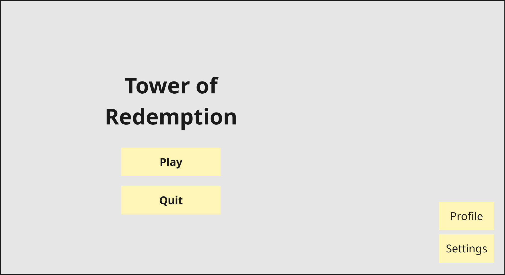
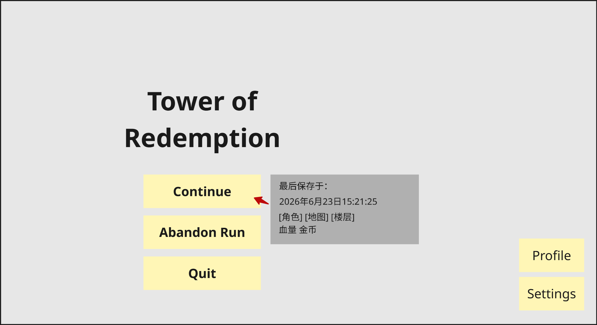
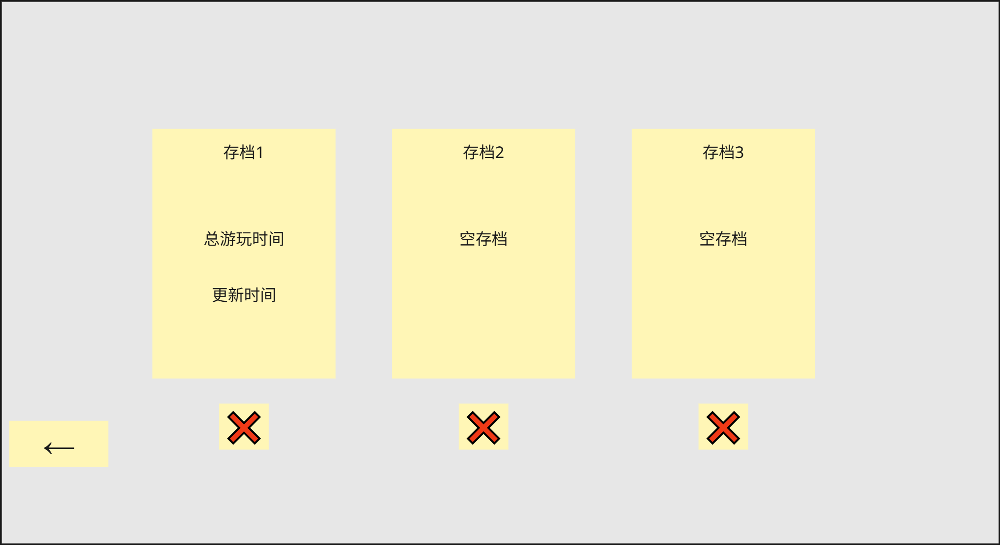

# 开始菜单界面

## 默认界面

* Paly：进入游戏
  * 进入选择角色界面
* Profile：存档
* Settings：游戏设置
* Quit：退出游戏
  * 需要二次确认

## 若有未完成的单局

* Paly：进入游戏
  * 指针悬浮在选项时，在选项右侧显示当局状态框最后更新时间
    * 角色图标、地图名称、楼层数
    * 血量（76/80）、金币（99）
* Abandon Run：放弃当前游戏
  * 需要二次确认
* Profile：存档
* Settings：游戏设置
* Quit：退出游戏

# 存档界面

* 共三个存档栏位。默认游戏保存至存档1
* 单个存档：
  * 点击切换至任意存档
  * 存档显示总游玩时间、更新时间。
    * 每个存档保存全局进度和当前对局进度（如果有）
  * 删除存档按键：位于每个存档下方，点击后弹出警告弹窗
* 左下方箭头：返回主界面

# 设置界面

### 画面设置

* 分辨率
  * 下拉框
  * 可选值：（代码提供）
  * 默认值：当前系统分辨率（2560×1600）
  * 切换后立即应用；勾选全屏模式时，分辨率栏置灰，显示N/A
* 最大帧数
  * 下拉框
  * 可选值：30/60/120
  * 默认值：60
  * 切换后立即应用
* 全屏模式
  * 复选框
  * 可选值：开启/关闭
  * 默认：关闭
  * 切换后立即应用；若失败，退回原值并提示

### 音频设置

* 主音量/音乐音量/音效音量
  * 滑块
  * 取值：0~100
  * 默认：50
  * 拖动实时生效；左侧实时显示当前音量值
* 主音量为0时，音乐和音效均静音

# 选择角色界面

* 底栏：角色头像按钮组
  * 两个角色的大头图像横排排列，每个按钮上对应一张角色立绘
  * 鼠标悬浮至按钮时，放大并高亮
  * 单击按钮时，选中该角色，高亮边框，播放选中音效
* 角色详情面板：
  * 默认选中左侧角色
  * 选中角色时，界面左侧弹出角色信息：
    * 角色名
    * 初始血量
    * 初始金币
    * 角色描述文字
    * 初始遗物及其描述
  * 背景为角色立绘，点击不同角色跳转至对应角色的立绘背景
  * 难度：
    * 首次对局不显示难度栏；完成第一次对局后，解锁难度
    * 共有10层，可以通过左右三角形按钮调整难度等级
    * 难度栏简述各个难度等级对应的特殊事件
  * 点击左下角箭头返回开始菜单界面；右下角✅️图标进入单局游戏
