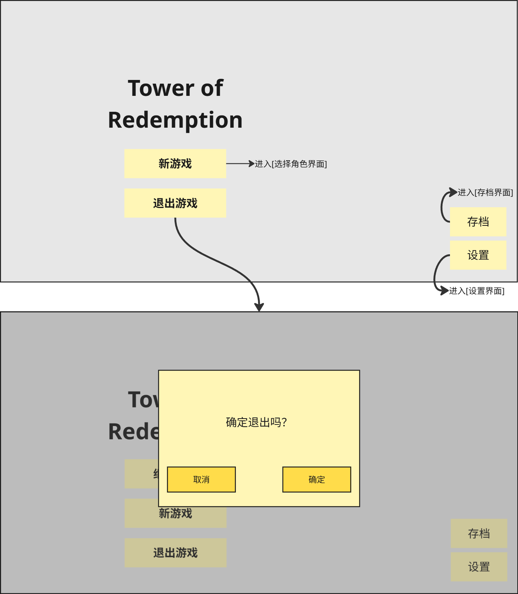
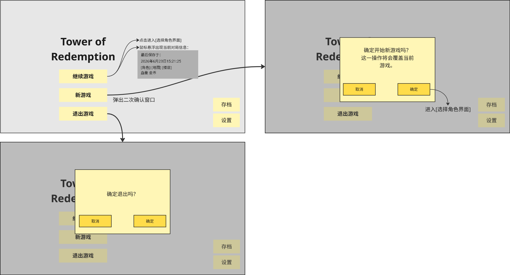
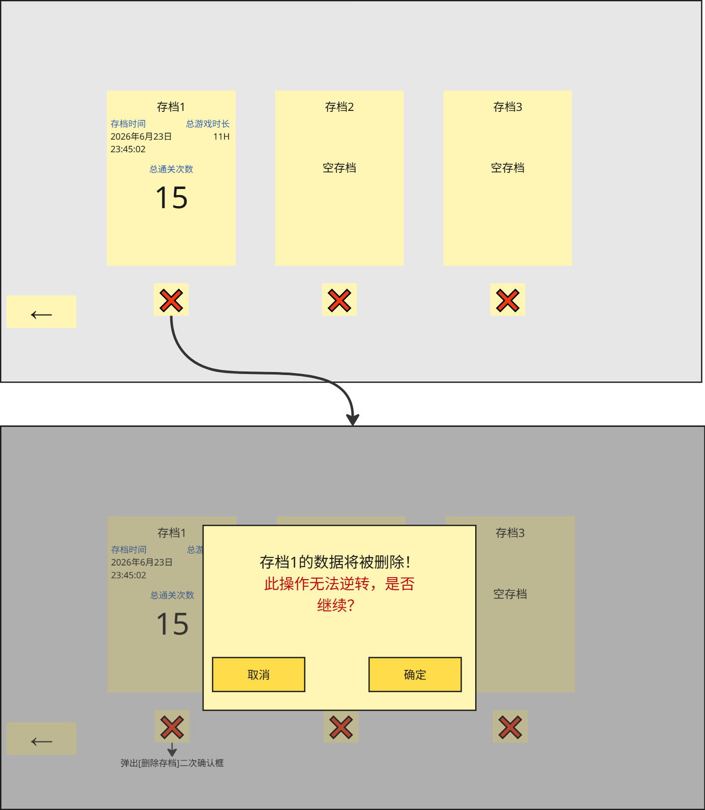
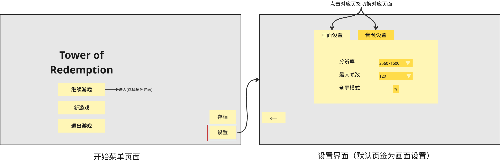
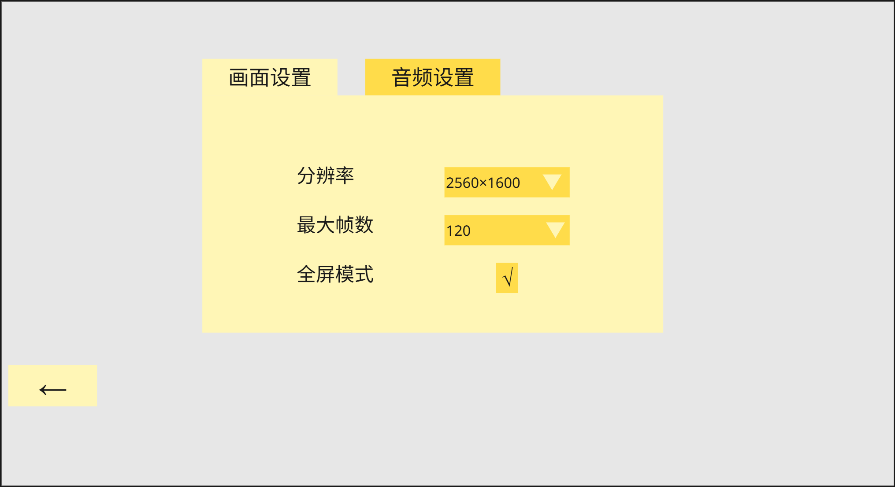
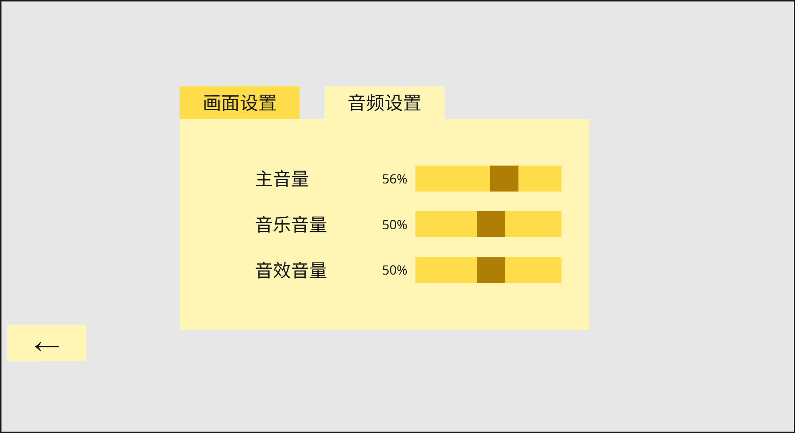
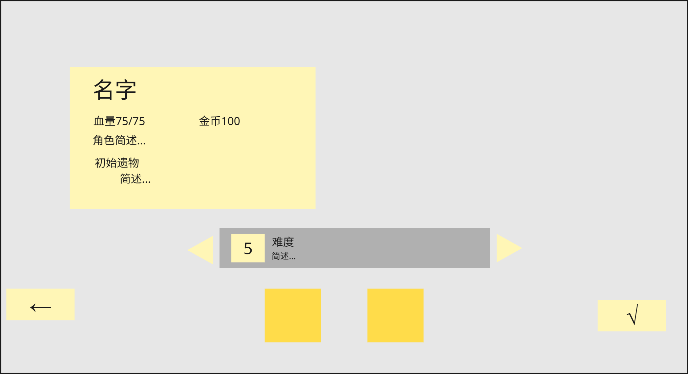

# 开始菜单界面

进入游戏的第一个界面。游戏主菜单存在两种展示状态：

1. 无进行中的存档对局；
2. 存在尚未通关、可继续游玩的存档对局。

- **第一种情况的界面如下：**

1. 新游戏：点击进入[选择角色界面]
2. 退出游戏：弹出 确认退出弹窗，二次确定后即可退出游戏
3. 存档：点击后进入[存档页面]。
   * 展示全部存档栏位（共三个栏位），用于新建、读取、删除游戏存档
4. 设置：点击后进入[设置界面]。
   * 设置游戏的画面和音频

* **第二种情况界面如下：**

1. 继续游戏：
   * 点击：进入[选择角色界面]
   * 鼠标悬浮：显示当前对局信息
     * 对局最后保存时间
     * 角色图标、地图名称、楼层数
     * 血量（76/80）、金币（99）
2. 新游戏
   * 当存在尚未通关、可继续游玩的存档对局时，点击新游戏进入二次确认弹窗，这一操作将会覆盖当前对局。
     * 点击[确定]：进入[选择角色界面]
     * 点击[取消]：返回当前界面
3. 退出游戏：弹出 确认退出按钮，二次确定后即可退出游戏
4. 存档：点击后进入[存档页面]。
   * 展示全部存档栏位（共三个栏位），用于新建、读取、删除游戏存档
5. 设置：点击后进入[设置界面]。
   * 设置游戏的画面和音频

# 存档界面

展示全部存档栏位（共三个栏位），用于新建、读取、删除游戏存档。

1. 共三个存档栏位。默认游戏保存至存档1
2. 单个存档显示内容：
   * 存档时间：最后一次保存存档的时间（例如：2026年6月23日23:55:52）
   * 总游戏时长：当前存档游玩的总时长（只记录小时数）
   * 总通关次数：记录当前存档所有角色通关次数
3. 删除存档按键
   * 位于每个存档下方，点击后弹出警告弹窗

# 设置界面

游戏系统设置。包括画面设置和音频设置两个页签。点击上方对应页签切换至对应页面。默认页签为画面设置。

### 画面设置

* 分辨率
  * 下拉框
  * 可选值：（配置提供）
  * 默认值：当前系统分辨率（2560×1600）
  * 切换后立即应用；*勾选全屏模式时，分辨率栏置灰，显示N/A*
* 最大帧数
  * 下拉框
  * 可选值：30/60/120
  * 默认值：60
  * 切换后立即使用（？）
* 全屏模式
  * 复选框
  * 可选值：开启/关闭
  * 默认：关闭
  * 切换后立即应用；若失败，退回原值并提示

### 音频设置

* 主音量/音乐音量/音效音量（简写一下，这个读哪个表，先创个空表）
  * 滑块
  * 取值：0~100
  * 默认：50
  * 拖动实时生效；左侧实时显示当前音量值
* 主音量为0时音乐和音效均静音
  * *要额外执行静音，后台声卡置0*

# 选择角色界面

* 底栏：角色头像按钮组（走XX表XX）
  * 两个角色的大头图像横排排列，每个按钮上对应一张角色立绘
  * 鼠标悬浮至按钮时，放大并高亮
  * 单击按钮时，选中该角色，高亮边框，播放选中音效
* 角色详情面板：
  * 默认选中左侧角色
  * 选中角色时，界面左侧弹出角色信息（走哪个表）：
    * 角色名：（走XX表XX）
    * 初始血量（走XX表XX）
    * 初始金币（走XX表XX）
    * 角色描述文字（走XX表XX）
    * 初始遗物及其描述（走XX表XX）
  * 背景为角色立绘，点击不同角色跳转至对应角色的立绘背景（走XX表XX）
  * 难度（走XX表XX）：
    * 首次对局不显示难度栏；完成第一次对局后，解锁难度
    * 共有10层，可以通过左右三角形按钮调整难度等级
    * 难度栏简述各个难度等级对应的特殊事件
  * 点击左下角箭头返回开始菜单界面；右下角✅️图标进入单局游戏
